# Welcome to lem0nSec's GitHub page! 👋

[-%23000000.svg?style=for-the-badge&logo=x&logoColor=white)](https://x.com/lem0nSec_)

-----------------------------------------------------------------------------------------------------------------------------------------------------------------

-----------------------------------------------------------------------------------------------------------------------------------------------------------------

__Hi lem0nS!__ 

I’m a __Security Researcher__ who is passionate about programming, reverse engineering, and binary exploitation. I spend most of my spare time researching OS internals and building software. Windows is my platform of choice, and I often define it '_my security playground_'. Feel free to explore my GitHub projects!

-----------------------------------------------------------------------------------------------------------------------------------------------------------------

## Stats

